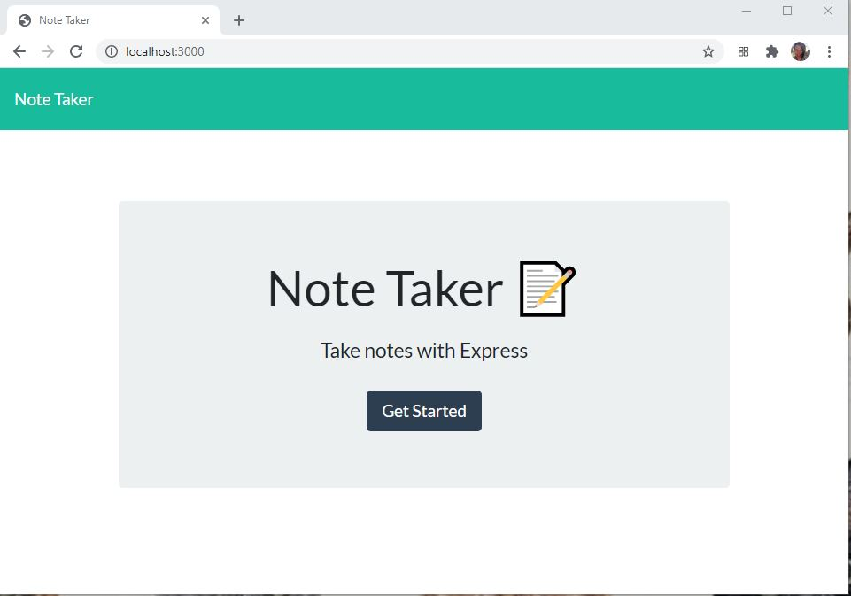
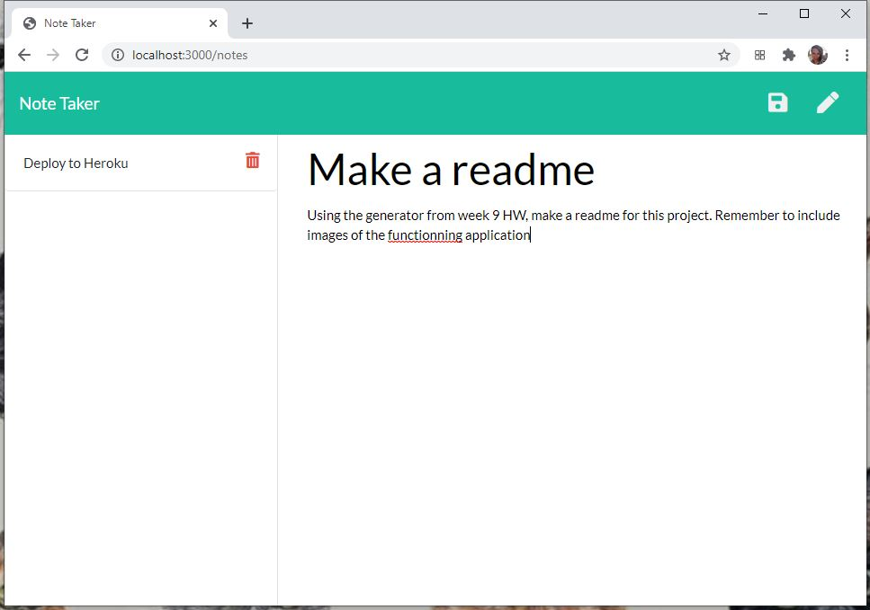
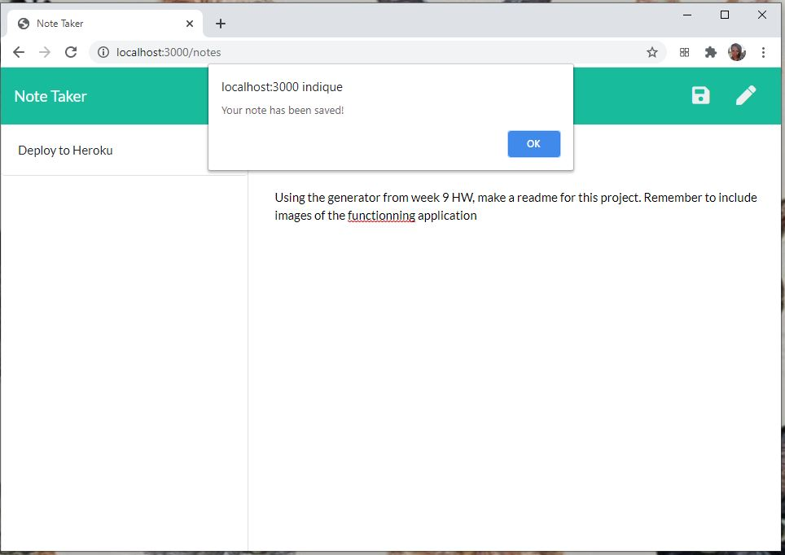
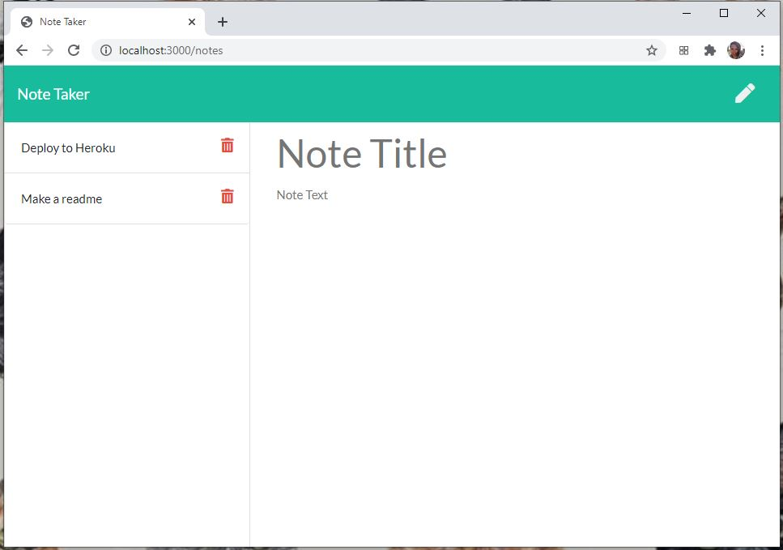
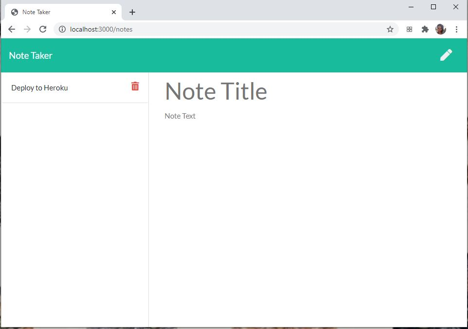

# quincantine- 

# Table of contents
1. [Description](#Description)
2. [Images of deployed application](#Images-of-deployed-application)
2. [Installation instructions](#Installation-instructions)
3. [Usage](#usage)
4. [Contributions](#Contributions)
5. [Testing instructions](#Testing-instructions)
6. [License](#License)
7. [Questions](#Questions)

## Description: 
This is an application where the user can enter notes to themselves that are stored on a server, and then they can view those notes at a later time. The user can also delete notes once they are finished with them. 

## Images of deployed application
This application is deployed in Heroku. 

When the user arrives he or she is greeted with the following screen:

Then the user can write a note as follows:

They can save the note when they are finished:

When they are finished with a note they can delete it:

## Installation instructions: 
This uses express, path, fs, and util.

## Usage: 
This project is geared towards people with jobs that require for them to remember a lot of small tasks and small details about that task, for example teachers.

## Contributions: 
This is currently a solo project for skolnikskolnik.

## Testing instructions: 
Users can run the application locally by entering "node script.js". Users should NOT use nodemon for this particular project.

## License:  
This project is covered under the MIT License license.

## Questions
Visit my <a href='https://www.github.com/skolnikskolnik'>github page.</a> 

Email me at jtskolnik@gmail.com with any additional questions you may have. I am always happy to talk to users of my product!